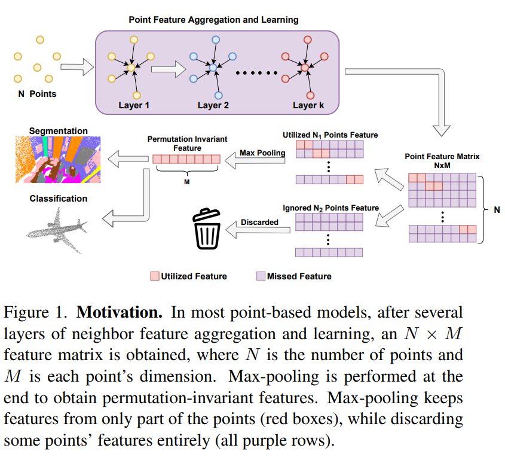
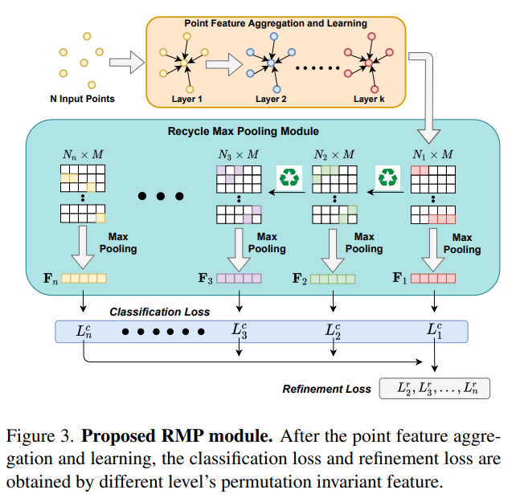

# Recycling Max Pooling Module for 3D Point Cloud Analysis (CVPR2022)
This is a pytorch implementation of the paper: *Why Discard if You can Recycle?: A Recycling Max Pooling Module for 3D Point Cloud Analysis*. The paper could be found [here](https://openaccess.thecvf.com/content/CVPR2022/papers/Chen_Why_Discard_if_You_Can_Recycle_A_Recycling_Max_Pooling_CVPR_2022_paper.pdf).
 **For a quck learning, you could go to /model/cls or /model/seg to compare the original DGCNN and DGCNN with RMP for classification and segmentation task. The code for ScanObjectNN, ModelNet40 and S3DIS dataset experiment has been given, I will finish the code instruction of ScanObjectNN and S3DIS as soon as possible.**
## Recycle Max Pooling Module 
The picture below shows the network structure of point-based method. Most point-based method use max pooling module to extract Permutation Invaraint Feature for downstream task. However, according to our abservation, a great number of points are completely discarded during the max pooling.


In order to solve this problem, we proposed the Recycling Max Pooling Module to make use of the discarded points' feature, which is shown below:
 \
For more details, please refer to the [paper](https://openaccess.thecvf.com/content/CVPR2022/papers/Chen_Why_Discard_if_You_Can_Recycle_A_Recycling_Max_Pooling_CVPR_2022_paper.pdf)

## Point Cloud Classification on ModelNet40
You can download the [official data](https://shapenet.cs.stanford.edu/media/modelnet40_ply_hdf5_2048.zip), and unzip it. The path of "Data" is needed for traning.

### Train
Training the original DGCNN

```
python main_modelnet40.py --data_path /path/to/Data --exp_name DGCNN
```

Training the DGCNN with RMP(Recycling Max Pooling)
```
python main_modelnet40_ref.py --data_path /path/to/Data --exp_name DGCNN_RMP
```

Evaluation is performed after each epoch's training. You could check the accuracy by
```
tensorboard --logdir /path/to/the/experiment
```

